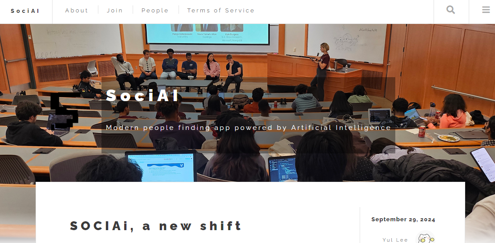

# SociAI



## *Technology brings people together*

At SociAI, we're transforming the way people connect online. By combining cutting-edge AI technology with social networking, we offer personalized compatibility insights that help users build more meaningful relationships. Our intelligent algorithms analyze user interests, behaviors, and preferences to recommend connections that truly resonate on a deeper level. Whether you're looking for friendship, community, or something more, SociAI ensures that every connection is authentic and tailored to your unique social needs. Join us and experience a smarter, more intuitive way to connect with the people who matter most!

> Used template from [html5up.net/future-imperfect](https://html5up.net/future-imperfect)
> Future Imperfect by HTML5 UP
> html5up.net | @ajlkn
> Free for personal and commercial use under the CCA 3.0 license (html5up.net/license)

## Local setup

Prerequisites

- mongo database
- node.js, version at least 20.0.0
- OpenAI api key for chatgpt

### Dot env configuration

```env
# database username
DB_USER=admin
# database password
DB_PASS=p@$$
# database ip or domain name
DB_HOST=cluster0plmy.mongodb.net

# open api key
OPENAI_API_KEY=sk-****

# optional, defaults to 3000
PORT=7777
```

### Running the server

```bash
# install all dependencies according to lock file
npm ci

# prepare for demo (sets up premade database dumps for you)
npm run prepare-demo

# run the server
npm start
```

## Technical explanation

### Auth and login/logout

User passwords are hashed using bcrypt. Sessions are managed by an `sid` http-only cookie. All login and logout routes are done in the backend, no client-side javascript involved

### Compatibility calculation

Every user-user compatibility is calculated via a semantic analysis call to chatgpt. This is then cached by combining all properties in the User model and hashing. If the hash changes, the semantic analysis call will reject the cache and calculate again.

---

*Time spent on project: approx 14hrs*
